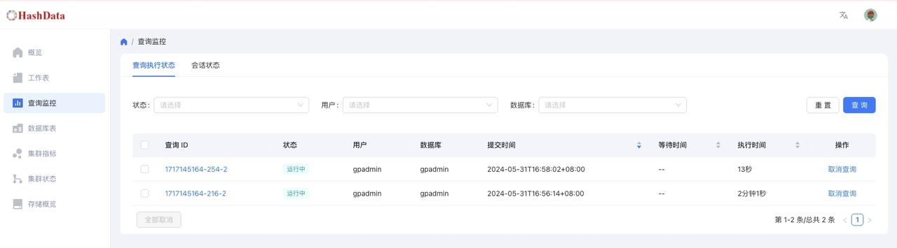
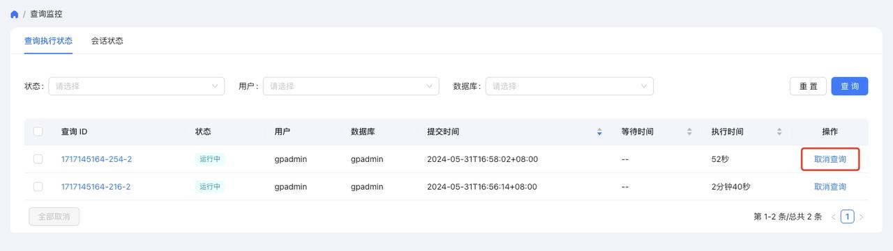
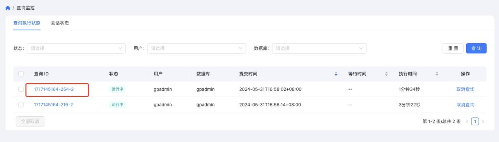
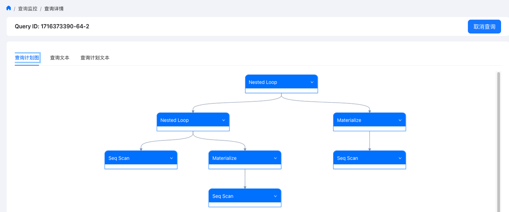

查看 SQL 监控信息
=================

HashData Lightning Web Platform 为数据库中的活动 SQL 提供监控信息。你可以在\ **查询监控**\ 面板下看到 SQL 语句的执行状态、各语句的执行详情以及数据库各会话的状态。面板示例如下：

前提条件
--------

要访问\ **查询监控**\ 面板，你需要：

1. 确保当前集群是通过可视化部署方法部署的。详情参见\ :ref:`可视化部署 <deploy-guides/physical-deploy/visualized-deploy:可视化部署>`\ 。
2. 在浏览器中通过 ``http://<集群节点 IP>:7788/`` 访问 Web Platform 面板。
3. 在左侧导航点击\ **查询监控**\ ，即可进入该页面。

查看 SQL 执行状态
-----------------

要查看某条 SQL 语句的执行状态，点击\ **查询执行状态**\ 标签。

在搜索区域，根据 SQL 语句的执行状态、所属用户、所在数据库，在对应的下拉选项框中进行选择，然后点击\ **查询**\ 来进行搜索。其中\ **用户**\ 支持多选。

其中\ **状态**\ 下拉选项框中的选项描述如下：

.. table:: 
   :align: left

   ====== ====================
   选项名 描述
   ====== ====================
   运行中 SQL 语句正在执行。
   已完成 SQL 语句已执行完成。
   中止   SQL 语句已被中止。
   取消中 SQL 语句正在被取消。
   ====== ====================

点击\ **查询**\ 后，下方区域会显示一个 SQL 列表，你应该能从列表中找到目标 SQL 语句。列表区域的字段说明如下：

.. table:: 
   :align: left

   +----------+----------------------------------------------------------+
   | 选项名   | 描述                                                     |
   +==========+==========================================================+
   | 查询 ID  | 标识 SQL 语句在数据库中执行的唯一 ID。                   |
   +----------+----------------------------------------------------------+
   | 状态     | SQL 语句执行的状态。                                     |
   +----------+----------------------------------------------------------+
   | 用户     | 执行 SQL 语句的用户。                                    |
   +----------+----------------------------------------------------------+
   | 数据库   | 执行 SQL 语句所在的数据库。                              |
   +----------+----------------------------------------------------------+
   | 提交时间 | SQL 语句提交的时间                                       |
   +----------+----------------------------------------------------------+
   | 等待时间 | 执行该 SQL 语句前的等待时间。                            |
   +----------+----------------------------------------------------------+
   | 执行时间 | 该 SQL 语句的执行时间。                                  |
   +----------+----------------------------------------------------------+
   | 操作     | 对于执行中的 SQL                                         |
   |          | 语句，你可以选择点击\ **取消查询**\ ，来取消执行该语句。 |
   +----------+----------------------------------------------------------+

取消 SQL 执行
~~~~~~~~~~~~~

要取消某条或某几条执行中的 SQL 语句，在 SQL 列表中找到对应 SQL 的\ **操作**\ 列，然后点击\ **取消查询**\ 。

查看 SQL 详情
~~~~~~~~~~~~~

要查看某条 SQL 语句的详情，点击该 SQL 语句的查询 ID，然后进入详情页面。

详情页面展示了 SQL 执行的详情，你可以点击不同标签来查看 SQL 语句的查询计划图、SQL 文本和查询计划文本。示例如下：

查看会话状态
------------

要查看数据库中的会话状态，在\ **查询监控**\ 页面中点击\ **会话状态**\ 标签。

**会话状态**\ 标签下的页面实时显示当前数据库中正在执行的会话列表，主要包括会话 ID、执行状态、执行操作的用户、执行操作的数据库、开始时间、应用名、闲置时间等。

.. image:: ../../images/web-platform-view-sql-monitor-info-5.png

要查看某个会话的详情，你可以在搜索区根据执行状态、用户、数据库以及应用名，在对应的下拉选项框中进行选择，然后点击\ **查询**\ 来进行搜索。其中\ **用户**\ 支持多选。

其中\ **状态**\ 下拉选项框中的选项描述如下：

.. table:: 
   :align: left

   ============ =================================================
   选项名       描述
   ============ =================================================
   运行中       后端正在执行会话。
   等待         后端正在等待新的客户端命令。
   事务中等待   后端处于事务中，但当前未执行查询。
   执行快速路径 后端正在执行快速路径功能。
   追踪禁用     如果在此后端禁用 track_activities，则报告此状态。
   未知         会话状态未知。
   ============ =================================================

点击\ **查询**\ 后，下方区域会显示一个会话列表，你应该能从列表中找到目标会话。

会话列表默认的排序规则是按\ **开始时间**\ 由近到远。你可以点击\ **开始时间**\ 进行升序操作，也可以通过\ **闲置时间**\ 进行排序。列表区域的字段说明如下：

.. table:: 
   :align: left

   +----------+----------------------------------------------------------+
   | 选项名   | 描述                                                     |
   +==========+==========================================================+
   | 会话 ID  | 标识会话在数据库中执行的唯一 ID。                        |
   +----------+----------------------------------------------------------+
   | 状态     | 该会话的状态。                                           |
   +----------+----------------------------------------------------------+
   | 用户     | 执行该会话操作的用户。                                   |
   +----------+----------------------------------------------------------+
   | 数据库   | 执行会话操作的数据库。                                   |
   +----------+----------------------------------------------------------+
   | 开始时间 | 会话开始的时间。                                         |
   +----------+----------------------------------------------------------+
   | 应用     | 执行会话的客户端应用。                                   |
   +----------+----------------------------------------------------------+
   | 闲置时间 | 会话的闲置时间。                                         |
   +----------+----------------------------------------------------------+
   | 操作     | 对于执行中                                               |
   |          | 会话，你可以选择点击\ **取消查询**\ ，来取消执行该会话。 |
   +----------+----------------------------------------------------------+
